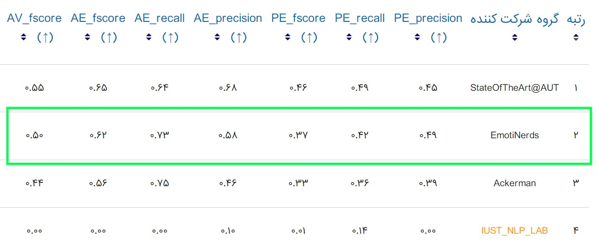

### Notice
After completing our research and publishing the paper, we will provide the complete code, including the training process and implementation of various methods, to ensure reproducibility and facilitate further exploration in the field.
For now, we provide our model checkpoints and testing script here.

## Goals

### 1. Predicting All Emotions Existence:
for each of the 6 classes, predict a binary label which means either the emotion is present in the given text or not. 
The emotions we consider are:
 - Anger
 - Disgust
 - Fear
 - Sadness
 - Happiness
 - Surprise

### 2. Predicting the Primary Emotion within 7 classes:
Predicting a single emotion that primarily represents the emotion of the given text within those 6 classes, along with an additional 'other' class for cases when the given text does not belong to one of those 6 classes.

## Datasets
 - EmoPars
 - ArmanEmo

## Paper Abstract
Emotion recognition in text is a fundamental aspect of natural language understanding, with significant applications in various domains such as mental health monitoring, customer feedback analysis, content recommendation systems, and chatbots. In this paper, we present a hybrid model for predicting the presence of six emotions: anger, disgust, fear, sadness, happiness, and surprise in Persian text. We also predict the primary emotion in the given text, including these six emotions and the “other” category. Our approach involves the utilization of XLM-RoBERTa, a pre-trained transformer-based language model, and fine-tuning it on two diverse datasets: EmoPars and ArmanEmo. Central to our approach is incorporating a single Bidirectional Gated Recurrent Unit (BiGRU), placed before the final fully connected layer. This strategic integration empowers our model to capture contextual dependencies more effectively, resulting in an improved F-score after adding this BiGRU layer. This enhanced model achieved a 2% improvement in the F-score metric on the ArmanEmo test set and a 7% improvement in the F-score metric for predicting the presence of six emotions on the final test set of the ParsiAzma Emotion Recognition competition.

## Model Architecture


## How to do the prediction
```
AE_PATH = 'model_ae.pth'
PE_PATH = 'model_pe.pt'

checkpoint_ae = torch.load(AE_PATH, map_location=torch.device('cpu'))
model_ae.load_state_dict(checkpoint_ae)

checkpoint_pe = torch.load(PE_PATH, map_location=torch.device('cpu'))
model_pe.load_state_dict(checkpoint_pe)

pe_predict(test_file,model_pe,tokenizer)
pe_prediction = pe_predict(test_file,model_pe,tokenizer)
ae_prediction = ae_predict(test_file,model_ae,tokenizer)

ae_prediction['primary_emotion'] = pe_prediction['primary_emotion']
final_result.to_csv('final_result.csv')

```
## Model Checkpoints Availability
[model_ae](https://drive.google.com/file/d/1mnB7fNxlu-PD1MgCTSCCT_ki7fcX6X9v/view?usp=sharing)
<br>
[model_pe](https://drive.google.com/file/d/1zzm9voS2ILDeux8q32xNMv03pEqN2hkd/view?usp=drivesdk)


## Results
### 1. ParsiAzma competition final results
### [link](https://parsiazma.ir/)
### 🏆 Second Place. =)


### 2. Our different model results on the ParsiAzma final test set 
| Model Configuration                                | AV macro fscore | AE macro fscore | AE macro recall | AE macro precision | PE macro fscore | PE macro recall | PE macro precision |
|----------------------------------------------------|-----------|-----------|-----------|-------------|-----------|-----------|-------------|
| Fine-tuning XLM-RoBERTa (base) on EmoPars for AE prediction & Fine-tuning ParsBERT on ArmanEmo for PE prediction | 0.42      | 0.55      | 0.66      | 0.52        | 0.28      | 0.36      | 0.43        |
| Fine-tuning XLM-RoBERTa (base) + GRU on EmoPars for AE prediction & Fine-tuning XLM-RoBERTa (base) on ArmanEmo for PE prediction | 0.46      | 0.59      | 0.86      | 0.49        | 0.33      | 0.39      | 0.47        |
| Fine-tuning XLM-RoBERTa (large) + GRU on EmoPars for AE prediction & fine-tuning XLM-RoBERTa (large) + GRU on ArmanEmo for PE prediction| 0.49      | 0.62      | 0.73      | 0.58        | 0.35      | 0.41      | 0.47        |
| Fine-tuning XLM-RoBERTa (large) + GRU on EmoPars for AE prediction & Fine-tuning XLM-RoBERTa (large) on ArmanEmo for PE prediction| **0.50**      | **0.62**      | **0.73**      | **0.58**        | **0.37**      | **0.42**      | **0.49**        |


## Acknowledgements

We would like to express our gratitude to the creators and contributors of the ArmanEmo and EmoPars datasets for their valuable work and for making their datasets publicly available for research purposes. We acknowledge their efforts in collecting and annotating the data, which greatly contributed to the development of our model.

- ArmanEmo Dataset: [Link](https://github.com/arman-rayan-sharif/arman-text-emotion)
- EmoPars Dataset: [Link](https://github.com/nazaninsbr/Persian-Emotion-Detection)

We also thank the organizers of the ParsiAzma National Competition for providing the opportunity to conduct this research. Their dedication to studying and working in the field of emotion recognition has been a driving force behind our project.
